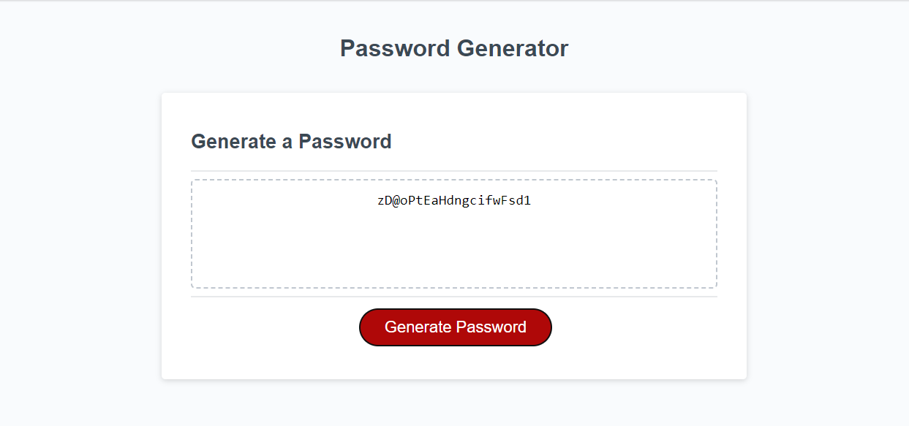

# Simple Password Generator

## Description 
This project is made to quickly create a randomly generated password between the lengths of 8 to 128 characters. this includes special characters, upper and lower case, as well as numbers. This was made to show proficiency in creating functions in javascript as well as using proper conditionals and using iteration. This also includes using window prompts and alerts. Through this project I was able to reliably use my knowledge of javascript to create this password generator in a relatively short amount of time.

## Table of Contents
- README file
- index.html: the file used for the contents of the site which was provided to me.
- style.css: the file used to style the site which was provided to me.
- script.js: the file that contains the 2 functions I created to run the password generator as well as some code given to me to make the button work as well as show the created password.
- a picture of the site after creating a random password.